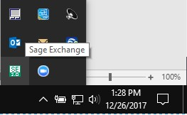
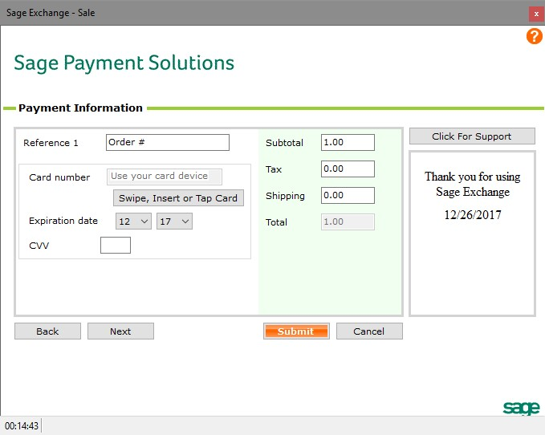
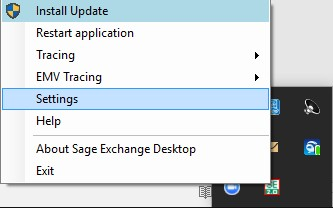
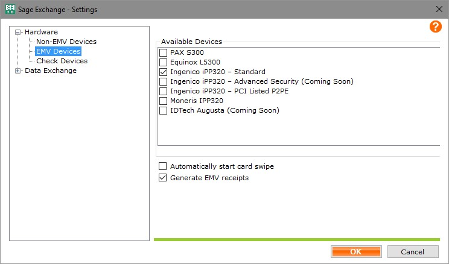

# Introduction
Sage Exchange Desktop (SED 2.0) is an installed .Net application which is fully PCI-DSS compliant. SED 2.0 allows an ISV to completely remove all sensitive payment data from their application workflow by leveraging the Sage Exchange Desktop UI interface. Features like tokenization, Level III processing, and EMV are baked directly into the same API.

This document includes details about installing and setting up SED 2.0 on your system so that you can quickly get started developing applications:

1. [QuickStart](#QuickStart)
1. [Installation](#Installation)
1. [Customizing SED 2.0](#Customizing)
1. [EMV Device Setup](#EMVSetup)
1. [Troubleshooting](#Troubleshooting)

##  QuickStart
The following sections cover installing and using SED 2.0 on your system.

### Installation
To install SED 2.0, first download and verify the installation file; then, run the installer. The following sections provide step-by-step instructions for performing these actions.

_Remove any previously installed versions of SED before installing the most recent version. See the section **[Uninstalling SED](#Uninstalling)** if needed._

Follow the steps below to download and verify the SED 2.0 installation tool:
1. Go to https://www.sageexchange.com/install/sed2/ and download the SED 2.0 installer.
1. Extract the zip file anywhere on your local machine.
1. Verify the digital signature of the files you downloaded.
   1. Right click **SageExchangeDesktopBootstrapper.exe** and select **Properties**. The SageExchangeDesktopBootstrapper.exe Properties window opens.

      
  

   2. Click the **Digital Signatures** tab and verify that the package is signed by **Sage Payment Solutions, Inc.**
   3. Click the line showing **Sage Payment Solutions, Inc.** in the Signature list area to select it.
   4. Click **Details**. The **Digital Signature Details** window opens.

      

   5. Under **Digital Signature Information** check that the message displays "This digital signature is OK."
   6. Click **OK** to close the **Digital Signature Details** window.
   7. Click **OK** to close the **SageExchangeDesktopBootstrapper.exe Properties** window.

Follow the steps below to install SED 2.0 on your local machine:
1. Right click **SageExchangeDesktopBootstrapper.exe** and select **Run as administrator**.
1. Enter your administrator credentials and then click **OK** to continue. The **Sage Exchange Desktop Setup** window opens.

   

1. Review the Sage End User License Agreement (EULA) and then select **I agree to the license terms and conditions**.
1. Click **Install** to start the installation.
1. Click **Yes** on the **User Account Control** window to allow the installer to make changes to the computer.
1. Click **Close** to close the **Sage Exchange Desktop Setup** window, indicating successful installation.

### Using SED 2.0
After installing SED 2.0 and every time you start up Windows, the SED 2.0 application will automatically launch. During startup the animated taskbar icon displays a rotating double-arrow icon as it loads and checks various startup parameters.

Once SED is successfully running and ready for use, the SED taskbar icon will change to a green and white SE text box and a Sage Exchange dialog bubble will display for a few seconds as shown below:

#### Sage Exchange Desktop Menu
Once startup is complete, access the SED 2.0 menu by right-clicking on the taskbar icon.

##### About Sage Exchange Desktop
To verify the version of SED that is currently installed and running, click **About Sage Exchange** on the menu. The version number displays just below the Sage Exchange title on the screen.  Other information on the screen includes the copyright details and the main Sage Payments support page URL and phone number.

#### Start Menu
As part of the installation process, the setup program installs a shortcut to launch SED 2.0 in the Windows start menu under the program group Sage Payment Solutions and on the desktop.

## Installation
The following sections provide details about installing SED 2.0 and distributing applications that use the SED 2.0 API:

1. [Components](#Components)
1. [Dependencies](#Dependencies)
1. [Distribution](#Distribution)
1. [External Device Components](#ExternalDevices)
1. [Uninstalling](#Uninstalling)
1. [Updates](#Updates)
1. [Upgrading](#Upgrading)

###  Components
Sage Exchange Desktop requires the installation of three software components. The installation of SED 2.0 and all dependencies is automated by the **Sage Exchange Desktop Bootstrapper**. In addition to the three Sage components, it will detect whether the Microsoft .Net 4.6 Framework is installed and will update the machine if required.

The installation process requires Administrator permissions and will prompt for password and acknowledgement based on the current user’s permission level and User Access Control (UAC) settings.

#### Sage Application Components
The SED Bootstrapper application installs the following components:

| Component                  | Description |
|---                         |---          |
| SPS Application Deployment | Sage application that manages the installation and updating of the Sage Exchange Desktop.                         |
| Sage Exchange Desktop API  | Sage class library that exposes COM interfaces used for integrating payment processing into external applications. |
| Sage Exchange Desktop      | Sage application used for processing payments and Sage Exchange messaging.                                     |

##### Sage Payment Solutions (SPS) Application Deployment
The SPS Application Deployment is bundled with the SED Bootstrapper installer.

###### Installation path
SPS Application Deployment is installed at the following location on your machine:
* [PROGRAM FILES]\Sage Payment Solutions\Application Deployment

###### Registry Entries
The following registry entries are related the SPS Application Deployment application and can be used to detect a valid installation from external software. If these keys are not present in the registry then it is an indication that the installation of this component failed:
* [LOCAL MACHINE]\Software\Sage Payment Solutions\Application Deployment\Path
* [LOCAL MACHINE]\Software\Sage Payment Solutions\Application Deployment\Installation Directory

##### Sage Exchange Desktop API
The Sage Exchange Desktop API is bundled with the Sage Exchange Desktop installer.

###### Installation Path
The Sage Exchange Desktop API is installed at the following location on your machine:
* [PROGRAM FILES]\Sage Payment Solutions\Sage Exchange Desktop API

###### Registry Entries
The following registry entries are related to the COM classes/interfaces supported by the API and can be used to detect a valid installation from external software. If these keys are not present in the registry then it is an indication that the installation of this component failed:
* [LOCAL MACHINE]\Software\Classes\CLSID\{CF5D885D-7838-4807-A2BA-BB0D92D9B1EA}
* [LOCAL MACHINE]\Software\Classes\CLSID\{AF364412-E730-4738-91BB-B73124B96633}
* [LOCAL MACHINE]\Software\Classes\clSedApi.ModuleClient
* [LOCAL MACHINE]\Software\Classes\clSedApi.ModuleResponse

##### Sage Exchange Desktop Application (SED 2.0)
If SED 2.0 is not already installed, the API will prompt the user to install it at runtime.  If the user clicks yes, the Bootstrapper will automatically download and install.
###### Installation Path
SED 2.0 is installed at the following location on your machine:
* [PROGRAM FILES]\Sage Payment Solutions\Sage Exchange Desktop

The installation folder contains only the deployment reference file. The actual Sage Exchange Desktop application files are managed by the SPS Application Deployment and can be found under its installation path.

###### Start Menu Shortcut
The SED Bootstrapper application adds a shortcut to SED 2.0 to the Start Menu, which is stored at the following location:
* [PROGRAM DATA]\Microsoft\Windows\Start Menu\Programs\Sage Payment Solutions\Sage Exchange Desktop

###### Registry Entries
The following registry entry is related the Sage Exchange Desktop application and can be used to detect a valid installation from external software. If this keys is not present in the registry then it is an indication that the installation of this component failed:
* [LOCAL MACHINE]\Software\Sage Payment Solutions\Sage Exchange Desktop\Path

###  Dependencies
SED 2.0 has the following dependencies:

| Component             | Description                                                   |
|-----------------------|---------------------------------------------------------------|
| MS .Net 4.6 Framework | Microsoft core .Net common application framework version 4.6. |
| Windows OS            | Microsoft Windows 7 SP1 or higher                             |

If the dependencies are not already installed on your machine, the SED Bootstrapper application will prompt you to install them.

###  Distribution
The Sage Exchange Desktop API (clSedApi.dll) may be bundled stand-alone with third party applications that have integrated with SED 2.0. The API will detect the need to install SED 2.0 at runtime and prompt the user for installation. The installation steps outlined above will start automatically.

_**Note:** The installation requires elevation to local machine Administrator level._

###  External Device Components
SED 2.0 supports additional peripheral hardware devices. Some of these devices require that additional components be installed in order to function properly. Since the hardware devices are optional these components are separate from the Sage Exchange Desktop installation. It is recommended you review your application requirements to determine which, if any, hardware devices you will be supporting in order to properly deploy the SED 2.0 to your end users.   

### Uninstalling
The programs installed as part of the SED installation will be displayed in the Windows **Programs and features** list. To uninstall SED, remove the following programs:
* SPS Application Deployment
* Sage Exchange Desktop

Select each program from the list and click **Uninstall** on the following window.

###  Updates
The SED 2.0 application automatically checks for application updates at launch and periodically while running. It is possible that upon first launch after initial install a new update will be available.

When an update is available, the update process will launch automatically. The update check can also be initiated manually from the SED menu.

If a new release of SED is available, the update process will launch. The following window displays the new version and release notes:

The release notes are cumulative and can be reviewed by scrolling the window.

Click the **Download and Install** button to continue.

Administrator permissions are required to perform the update.

If the update is mandatory, it must be applied before SED can be started, and the Skip button in the update window will be disabled. If the update is optional, you can click Skip to update at a later time. Optional updates are recommended to be applied as soon as possible, and the update check will continue to display the available update until it is installed.

###  Upgrading from SED 1.0 to SED 2.0
The main Sage Exchange Desktop 1.0 components should be removed prior to installing SED 2.0. This includes Sage Exchange and the Module SDK.  Sage Exchange device drivers for credit card terminals do not have to be uninstalled or reinstalled. Current SED 1.0 devices are also supported on SED 2.0.  Within the Windows Control Panel, the Programs and Features utility can be used to uninstall the following two programs.

*	Sage Exchange version 1.0.6.x (or earlier)
*	Module SDK version 1.0.x  

These programs will be listed with Publisher Sage Payment Solutions. Sorting by publisher will help locate the currently installed Sage applications.  Click the program in the list to select it and click Uninstall in the title banner of the list. Follow the prompts to uninstall and remove the existing 1.0 components.

#### Key Differences from SED 1.0
The Sage Exchange Desktop 2.0 application looks and functions much the same way as the 1.0 version with some key differences worth noting for those familiar with the previous version. The Sage Exchange SDK has been superseded by the Sage Exchange Desktop API. The new API interface is essentially the same but does require a recompile and minor changes for existing third-party integrations. The SED 1.0 underlying Sage Exchange XML messaging formats and structures are forwards compatible.

The following table lists the differences between the components and features of SED 2.0 and SED 1.0:

| Component               | SED 2.0.n.x                 | SED 1.0.6.x               |
|-------------------------|-----------------------------|---------------------------|
| .Net Framework          | .Net 4.6                    | .Net 3.5                  |
| PA-DSS Compliance       | PA-DSS 3.1                  | PA-DSS 2.0                |
| Encryption Level        | TLS 1.2                     | TLS 1.0                   |
| Installation Framework  | Microsoft Installer (WiX)   | Microsoft ClickOnce       |
| Deployment Framework    | SPS App Deploy              | Microsoft ClickOnce       |
| Installation            | All Users (per machine)     | Current User              |
| Install Location        | Program Files               | User AppData Directory    |
| Installation Permission | Administrator               | Local User                |
| Auto Updates Permission | Administrator               | Local User                |
| Publisher Certificate   | CA Issued Code Signing Cert | Sage SPS Self-signed Cert |
| Integration Component   | Sage Exchange Desktop API   | SPS Module SDK            |

#### References
The SED 2.0 API implements the same methods and includes the same interface as the SED 1.0 Module SDK. To upgrade your solution from SED 1.0 to SED 2.0, you will need to change the references to use the new SED 2.0 API.

The table below defines the new identifiers and key values that you will need to update in your code:

| Component           | SED API v2.0                          | SED API v1.0                          |
|---------------------|---------------------------------------|---------------------------------------|
| .Net Framework      | .Net 4.6                              | .Net 3.5                              |
| Install Location    | Program Files\\Sage Payment Solutions | Program Files\\Sage Payment Solutions |
| Installation Folder | \\Sage Exchange Desktop API           | \\Sage Payment Module SDK             |
| Loadable DLL        | clSedApi.dll                          | SpsModuleSdkCL.dll                    |
| Client PROGID       | clSedApi.ModuleClient                 | SpsModuleSdkCL.ModuleClient           |
| Response PROGID     | clSedApi.ModuleResponse               | SpsModuleSdkCL.ModuleResponse         |
| Client CLSID        | CF5D885D-7838-4807-A2BA-BB0D92D9B1EA  | 89BB4535-5A89-43a0-89C5-19A4697E5C5C  |
| Response CLSID      | AF364412-E730-4738-91BB-B73124B96633  | 41A449A9-EFA9-45e5-A6BD-9896A8194CD0  |
| COM Objects         | IModuleClient/IModuleResponse         | IModuleClient/IModuleResponse         |
| SED Not Detected    | API Initiates SED 2.0 Install         | SDK Initiates SED 1.0 Install         |

##  Customizing SED 2.0
You can customize Sage Exchange Desktop v2.x for your application by modifying the default colors on the user interface and choosing to hide or show fields.

### Modifying the User Interface
You can modify elements such as text color, background color, group box color, and hide or show elements and fields on the Sage Exchange Desktop user interface by changing default values of tags in the &lt;UI\> (user interface) section of XML code for each user interface XML transaction.

#### Hiding or Showing fields
The tags in the &lt;SinglePayment>&lt;/SinglePayment> section within the UI code allow you to show or hide fields on the Payment Information page of the SED user interface. For example, you can choose to hide fields such as Reference Number or Shipping in the Totals group box or extra address lines on the Billing Information page by setting the tag values to false.

The image below shows the SinglePayment section of the SED 2.0 XML messaging specification. Change the value of the &lt;Visible> element from 'true' to 'false' to hide that field on the user interface:

#### Disabling Manual Card Number Entry
You can also use the UI section of the XML message to prevent credit card numbers from being manually entered. Add the &lt;CanEnterAccount> tag (and value) to your code to disable manual entry in the Card Number field on the Sale window. This will require the user to swipe or dip the card, or to key the credit card number on the hardware terminal connected to Sage Exchange Desktop.

The following image shows the &lt;CanEnterAccount> element:

The image below shows how the Card Number field is disabled for entry on the Sale window if you add the tag above to your code:

##  EuroPay, Master Card, and Visa (EMV) Device Setup
The following sections describe how to set up a chip enabled terminal to process EMV transactions using SED 2.0.

Sage Exchange Desktop v2.x is certified on the following devices:
* Ingenico IPP320
* Equinox L5300
* PAX S300

### Downloading Device Drivers
You can download the recommended drivers for each device from the Sage Exchange Desktop Installation web site. Be sure to download the correct **EMV-Compatible** driver.

### Enabling the Device
After you install the device drivers, follow the steps below to enable your device in Sage Exchange Desktop.

1. Right-click the green **SE 2.0** icon in the Microsoft Window system tray and then click **Settings** from the submenu to open the Sage Exchange Desktop – Settings window.

1. Expand the **Hardware** node on the left-hand side and then click **EMV Devices**.

1. On the right-hand side, click your installed device (or devices) from the list of **Available Devices**. Sage Exchange Desktop will restart, and you will be ready to accept payments.

## Troubleshooting
The following sections describe where to locate log files and how to configure a Moneris QA server, if your SED 2.0 implementation is not functioning as expected.

### Log Files
In the event a Sage Exchange Desktop installation fails, please check that the user installing the application has the proper permissions. These paths may vary slightly between different computers. Some folders (e.g., AppData) may be hidden by default.

#### Installation Logs
Installation logging is automatically enabled. The logs can be found in in the following directory:
* C:\Users\[USER]\AppData\Local\Sage Payment Solutions\Application Deployment

#### Application Logs
Application logging must be enabled by turning on “Tracing” in the SED 2.0 menu. The logs can be found in the following location or by selecting the View Log option in the SED 2.0 menu:
* C:\Users\[USER]\AppData\Local\Sage Payment Solutions\Sage Exchange Desktop

### Moneris QA Server
There is a configuration variable that will allow you to point SED towards the Moneris QA server. This only applies when using the Moneris iPP320.

Follow the steps below to point your SED 2.0 installation to the Moneris QA server:
1.	Close SED.
2.	Run Notepad (or your preferred text editor) as an administrator.
3.	Open [PROGRAM FILES]\Sage Payment Solutions\Application Deployment\Applications\[GUID]\[VERSION]\SageExchange.exe.config.
4.	Look for UseMonerisQAHost and set it to either True or False as desired.
5.	Save the file.
6.	Close Notepad.
7.	Open SED.

The application log will indicate whether or not it is attempting to use the QA server.
